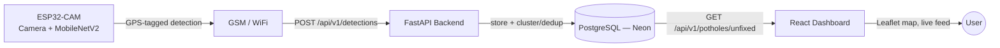

# 🛣️ RoadScanAI

**An end-to-end smart pothole detection and GPS mapping system.**

RoadScanAI is a full-stack IoT + AI project that detects and classifies road damage in real time using an ESP32-CAM running an on-device MobileNetV2 classifier, tags each detection with GPS coordinates, and streams the data to a cloud backend that deduplicates and serves it to a live web dashboard for visualization.

```
📷 ESP32-CAM  →  🧠 On-device inference  →  📡 GPS + GSM/WiFi  →  🗄️ FastAPI + PostgreSQL  →  🖥️ React dashboard
```

---

## Table of Contents

- [How it works](#how-it-works)
- [Repository structure](#repository-structure)
- [Components](#components)
  - [🔌 Firmware — `pothole-platformio/`](#-firmware--pothole-platformio)
  - [🗄️ Backend — `roadscanai-backend/`](#️-backend--roadscanai-backend)
  - [🖥️ Frontend — `frontend/`](#️-frontend--frontend)
  - [☕ `backend-spring/`](#-backend-spring)
- [Getting started](#getting-started)
- [Tech stack](#tech-stack)

---

## How it works

1. **Capture & classify** — An ESP32-S3 CAM module continuously captures road-surface frames and runs a quantized **MobileNetV2** model directly on-device (via TensorFlow Lite Micro) to classify each frame as `normal`, `low`, `medium`, or `high` severity damage.
2. **Locate** — A NEO-6M GPS module tags every detection with latitude/longitude, fix quality (HDOP), and speed.
3. **Transmit** — On detecting damage (anything other than `normal`), and after a cooldown to avoid duplicate spam, the device sends a JSON payload over WiFi/GSM (SIM800L) to the backend.
4. **Store & deduplicate** — A FastAPI backend persists every raw detection and clusters nearby/recent readings into a single "pothole" record — severity is only ever upgraded, never downgraded, as more readings come in.
5. **Visualize** — A React + Leaflet dashboard polls the backend for all currently unfixed potholes and renders them as color-coded markers on a live map, with a filterable feed and stats panel.



---

## Repository structure

```
road_scan_ai/
├── pothole-platformio/     # ESP32-S3 firmware: camera, on-device ML inference, GPS, GSM/WiFi
├── roadscanai-backend/     # FastAPI + PostgreSQL backend — the active production API
├── frontend/               # React + Vite + Tailwind + Leaflet live dashboard
└── backend-spring/         # Early Spring Boot + MongoDB API prototype (superseded, kept for reference)
```

---

## Components

### 🔌 Firmware — [`pothole-platformio/`](pothole-platformio)

ESP32-S3 (PlatformIO/Arduino) firmware for the in-vehicle detection unit.

- **Camera** — captures frames and converts JPEG → RGB888 for inference (`camera/`).
- **Model** — runs a MobileNetV2 classifier on-device via TFLite Micro, producing a class (`Normal`/`Low`/`Medium`/`High`) and confidence per frame (`model/`).
- **GPS** — parses NMEA data from a NEO-6M module for lat/lon, fix status, and speed (`gps/`).
- **GSM / WiFi** — sends detection alerts to the backend over WiFi or a SIM800L GSM fallback (`gsm/`, `wifi/`).
- Uses FreeRTOS tasks and queues to run inference, GPS parsing, and network transmission concurrently, with a cooldown (~5–8s) between alerts to avoid duplicate reporting of the same pothole.

### 🗄️ Backend — [`roadscanai-backend/`](roadscanai-backend)

The active FastAPI backend that the firmware and dashboard talk to.

- **Stack**: FastAPI, SQLAlchemy, PostgreSQL (hosted on [Neon](https://neon.tech)), managed with [`uv`](https://docs.astral.sh/uv/).
- **`POST /api/v1/detections`** — receives GPS-tagged detections from the ESP32-CAM, storing every raw reading and clustering it into an existing pothole (within ~8m and ~4s) or creating a new one.
- **`GET /api/v1/potholes/unfixed`** — serves all currently active (unfixed) potholes for the dashboard to poll and render.
- See [roadscanai-backend/README.md](roadscanai-backend/README.md) for full API reference, setup instructions, and known limitations.

### 🖥️ Frontend — [`frontend/`](frontend)

A live monitoring dashboard built with React 18, Vite, Tailwind CSS, and `react-leaflet`.

- Polls `GET /api/v1/potholes/unfixed` on an interval (with request timeout/abort handling and stale-data retention on failure) via a custom [`usePotholes`](frontend/src/hooks/usePotholes.js) hook.
- Renders potholes as color-coded map markers (🟢 low, 🟠 medium, 🔴 high) with detail popups, plus a synchronized sidebar feed, filter bar, and stats panel.
- Deployed as a static build to Vercel; backend URL is configured via the `VITE_API_URL` env var.
- See [frontend/README.md](frontend/README.md) for setup and folder structure.

### ☕ `backend-spring/`

An earlier Spring Boot + MongoDB prototype API (basic CRUD for pothole records). Superseded by the FastAPI backend above; kept in the repo for reference.

---

## Getting started

Each component can be run independently — see its own README for details:

| Component | Setup |
|---|---|
| Backend | `cd roadscanai-backend && uv sync && uv run python init_db.py && uv run uvicorn app.main:app --reload` |
| Frontend | `cd frontend && npm install && npm run dev` |
| Firmware | Open `pothole-platformio/` in [PlatformIO](https://platformio.org/) and flash to an ESP32-S3 devkit |

---

## Tech stack

- **Firmware**: ESP32-S3, Arduino/PlatformIO, TensorFlow Lite Micro (MobileNetV2), NEO-6M GPS, SIM800L GSM
- **Backend**: FastAPI, SQLAlchemy, PostgreSQL (Neon), `uv`
- **Frontend**: React 18, Vite, Tailwind CSS, react-leaflet
- **ML**: MobileNetV2 (4-class severity classifier: normal / low / medium / high)
